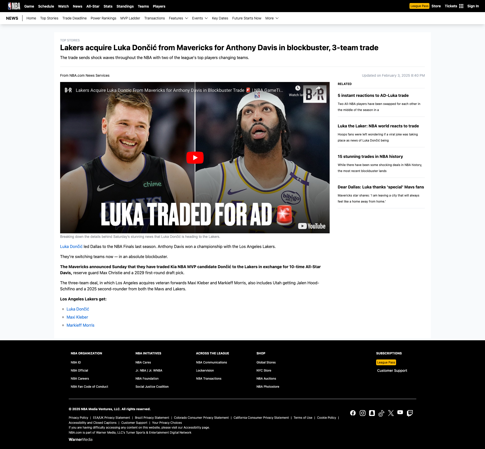

# NBA React + TypeScript + Vite Project

## Introduction

This project demonstrates a responsive and user-friendly design using React. The goal is to showcase my skills in React development by replicating the content shown in the provided screenshot.

## Features

- Responsive layout that adapts to different screen sizes
- User-friendly design with refined styling
- Dummy content to demonstrate the layout and functionality

## Screenshots

### Home Screen



## Requirements

- Node.js v18.19.1 or later
- npm v10.2.4 or later

## Installation

To get started with this project, follow these steps:

1. **Clone the repository:**

   ```bash
   git clone https://github.com/fung626/bibliotheque-news-react-app
   ```

2. **Navigate to the project directory:**

   ```bash
   cd bibliotheque-news-react-app
   ```

3. **Install dependencies::**
   ```bash
   npm install
   ```

## Running the Project

1. **Start the development server:**

   ```bash
   npm run dev
   ```

2. **Open the application:**
   - Navigate to `http://localhost:{port}` in your browser to view the application.

## Deployment

The application is deployed and accessible at:

[Demo](https://fung626.github.io/bibliotheque-news-react-app/)

## Design Ideas and Challenges

- **Responsive Design:** Responsive Design: Utilized Flexbox and Tailwind CSS for layout management to ensure the application is responsive across different screen sizes..
- **Refined Styling:** Applied consistent color schemes, padding, and font styles using Tailwind CSS to enhance the visual appeal.
- **Component-Based Architecture:** Created reusable components for the main content and sidebar to maintain a clean and modular codebase.
- **Vite Integration:** Leveraged Vite for its fast build times and efficient development experience.

## Conclusion

This project demonstrates my ability to create a responsive, user-friendly design using React. It showcases my skills in layout design, state management, and performance optimization. Feel free to explore the code and provide feedback!

## Contact

If you have any questions or suggestions, feel free to contact me at [fung626@gmail.com].
